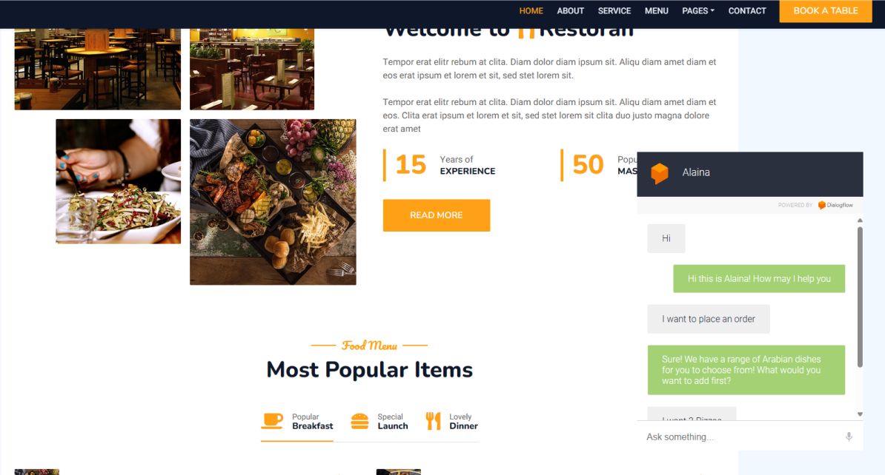

# Alaina - AI Waitress Application

Alaina is an AI waitress application designed to streamline the ordering process for restaurants through natural language understanding and backend integration. Built on Dialogflow using Google AI NLP and MySQL, Alaina aims to provide a seamless and efficient ordering experience for both customers and restaurant staff.
 

Caption: Alaina usage demonstration
## Features

- **Natural Language Understanding**: Alaina leverages Google AI NLP to understand natural language queries and commands from customers.
  
- **Order Management**: Alaina seamlessly integrates with a MySQL backend to manage orders, ensuring accuracy and efficiency in the ordering process.
  
- **Customizable Responses**: Restaurant owners can customize Alaina's responses to match their brand personality and provide personalized interactions with customers.

## Getting Started

To get started with Alaina, follow these steps:

1. **Dialogflow Setup**: Create a Dialogflow agent and import the provided intents and entities to enable natural language understanding.

2. **MySQL Integration**: Set up a MySQL database to store and manage orders. Update the database credentials in the backend code for seamless integration.

3. **Backend Deployment**: Deploy the backend code to a server or cloud platform of your choice. Ensure that the backend is accessible to the Dialogflow agent for order management.

4. **Dialogflow Fulfillment**: Configure Dialogflow fulfillment to communicate with the backend for order processing. Update the fulfillment code with the appropriate endpoints and logic to handle orders.

5. **Testing and Training**: Test Alaina extensively to ensure smooth interactions and accurate order processing. Train the Dialogflow agent with additional phrases and variations to improve natural language understanding.

## Contributing

Contributions to Alaina are welcome! If you have any ideas for new features, improvements, or bug fixes, feel free to open an issue or submit a pull request.

## License

This project is licensed under the [MIT License](LICENSE).

## Acknowledgements

- Google Dialogflow for providing a powerful natural language understanding platform.
- Google AI NLP for enabling advanced language processing capabilities.
- MySQL for efficient data management and backend integration.

