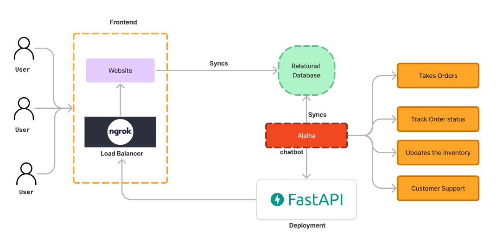

# Alaina - AI Waitress Application

Alaina is an AI-driven chatbot designed to assist startups, particularly restaurants, by automating order taking, order tracking, inventory updates, and customer support. Built using Dialogflow's NLP classification from Google, Alaina aims to reduce labor costs for sole traders, allowing them to focus on delivering their products.
 
 

## Introduction
Alaina: AI Waitress is a scalable chatbot solution initially designed for restaurants but adaptable to various other industries. It helps automate key business processes, thereby reducing the need for human labor and improving operational efficiency.

## Architecture
The architecture of Alaina is designed to handle multiple user interactions seamlessly. Below is an overview of the system architecture:

- **Frontend**: The user interface accessed through a website.
  - **Load Balancer (ngrok)**: Distributes incoming traffic across multiple servers to ensure reliability and scalability.
  - **Website**: Interface where users interact with the chatbot.

- **Backend**: Handles the core functionalities of the chatbot.
  - **Alaina (Dialogflow Chatbot)**: The main chatbot application that processes user queries and interacts with the backend systems.
  - **FastAPI**: Deployment framework for the chatbot, enabling API functionalities.
  - **Relational Database**: Stores and syncs data related to orders, inventory, and customer interactions.

## Features
- **Takes Orders**: Users can place orders through the chatbot.
- **Track Order Status**: Users can track the status of their orders in real-time.
- **Updates Inventory**: Automatically updates inventory based on orders placed and fulfilled.
- **Customer Support**: Provides automated support for common customer inquiries.

## Technologies Used
- **Dialogflow**: For natural language processing and chatbot functionalities.
- **Python**: Core programming language used for backend development.
- **FastAPI**: A modern, fast (high-performance) web framework for building APIs with Python.
- **ngrok**: For local development and exposing local servers to the internet.
- **Relational Database**: For storing order, inventory, and customer data.
- **Power BI**: Used in data analysis projects related to the system.
